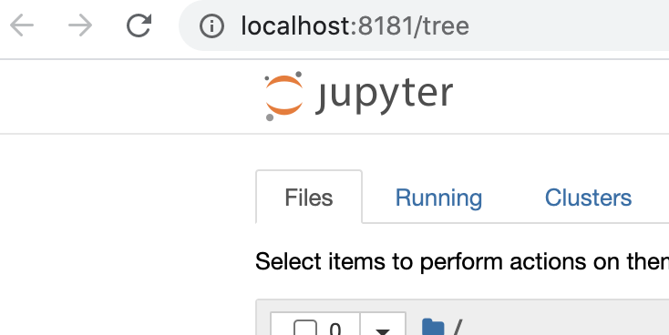

# Geoprocessing Workstation ☁️🌎📦

This project aims to enable the deployment of a dockerised workstation that can be SSH'd into

* [How to use](#how-to-use)
* [General usage](#general-usage)
* [With VS Code Remote SSH](#with-vs-code-remote-ssh)
* [How this all works](#how-this-all-works)
* [Customising the container image](#customising-the-container-image)

# How to use

To be able to deploy your own workstation, you will need some prerequisites installed:

* Pyenv/Python3
* Pipenv
* NVM/Node
* NPM
* aws-cdk (via `npm install`)

## General usage

### 1. Install dev dependencies

```bash
$ pipenv install -d
```

### 2. Create an SSH keypair

```bash
$ ssh-keygen -b 2048 -t rsa -f <a-path-to-save-the-file-to> -q -N ""
```

### 3. Prepare .env file

To perform some actions, this project requires a `.env` file to be present in the base of the project with some variables present. Your `.env` file should look like:

```.env
IDENTIFIER=<an example identifier for your deployment> # eg. my-dev
SSH_PRIVATE_KEY_LOCATION="<path/to/the/private/key>" # You created this in Step 3
SSH_PUBLIC_KEY="<the contents of your public key>" # You created this in Step 3
SSH_CONFIG_LOCATION="<path/to/your/ssh/config/file>" # This is optional, if not provided, a config file will be created for you
```

### 4. Deploy the instance

```bash
$ make deploy
```

### 5. SSH to your instance

```bash
$ ssh geoprocessing-workstation-<value of IDENTIFIER>
```

## With VS Code Remote SSH

VS Code has an extension called [VS Code Remote SSH - Available here](https://marketplace.visualstudio.com/items?itemName=ms-vscode-remote.remote-ssh) - With this extension you can SSH onto a machine and develop on it in VS Code (locally). It also provides other utitilies such as SSH Port Forwarding.

To use the extension, install it and then make sure you've done Steps 1-4 under [General usage](#General-usage)

### 1. Find Remote SSH command

With the plugin enabled, either open the actions menu in VS Code (MacOS is `CMD + Shift + P`), or select the little icon to the bottom left, selecting `Remote-SSH: Connect to Host...`


### 2. Connect to host

You should now see a prompy with the contents of your SSH Config file (listing the hosts), you should see `geoprocessing-workstation-<IDENTIFIER>` - select that.


_Note: You might not see your workstation here, this is usually the case if you A: do not have an SSH Host config file in the default location or B: you didn't provide one and the deployment has generated you one in `.ssh/config` in the root of the repository._

_You can remedy this by selecting `Configure SSH Hosts...` and then `Settings` and providing the path to the non standard location_

_The setting name is `remote.SSH.configFile`, if you'd rather search for it_

### 3. Pointers

#### Files
Now that you have established a connection to the instance, you can open files/folders on it like you would normally in VS Code: `File -> Open...`

#### Extensions
Because VS Code Remote SSH bootstraps an VS Code server on the running instance, we can install any VS Code extension inside it, allowing us access to language support, enhanced debugging, and various other features.

#### Accessing services like Jupyter
If your instance has a service like Jupyter Notebook installed, you can run this headless and then SSH Port Forward the port it's running on to localhost:

```bash
# On the instance
$ jupyter-notebook --no-browser --port=<a-port>
```

When you then look at the Remote SSH pane, you'll see `Ports` which shows you which ports have services running on them in the instance, you can then select them to forward them on


Then you can access it on `localhost:<a-port>`:



# How this all works

This project revolves around the ability to add a SSH client to a Docker container that we then serve via [AWS Fargate](https://aws.amazon.com/fargate/)

Below is a high level diagram of what is happening architecturally:


